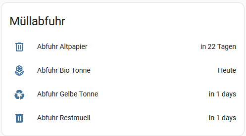

# Abfallkalender für die Stadt Geilenkirchen

Da die Stadt Geilenkirchen im Kreis Heinsberg leider keine ICS Kalenderdateien zur Verfügung stellt, habe ich mir mal die mühe gemacht, die ICS Dateien für jeden einzelnen Bezirk zu erstellen.

Hier findet Ihr die Abfallkalender nach Bezirken 1 - 6 sortiert, siehe Dateinamen.


### Integration in HomeAssistant mit "Waste Collection Schedule"

Die ICS Dateien sind mit dem "Waste Collection Schedule" für HomeAssistant kompatibel.

configuration.yaml
``` yaml
sensor: !include sensors.yaml


waste_collection_schedule:
  sources:
    - name: ics
      args:
        # Den Kalender für deinen Bezirk umbenennen und nach "config\www" kopieren
        file: "www/Abfuhrkalender.ics"
      customize:
        - type: Leichtverpackungen (Gelbe Tonne)
          alias: gelbe tonne
          icon: mdi:recycle
        - type: Restabfall (graue Tonne)
          alias: rest
          icon: mdi:trash-can
        - type: Altpapier (blaue Tonne)
          alias: papier
          icon: mdi:trash-can-outline
        - type: Bioabfall (braune Tonne)
          alias: bio
          icon: mdi:flower-outline
          
  fetch_time: "01:00"
  day_switch_time: "23:00"
```

sensor.yaml
``` yaml
  # Abfall
  - platform: waste_collection_schedule
    name: Abfuhr Restmuell
    details_format: "upcoming"
    value_template:  'HeuteMorgenin {{value.daysTo}} Tagen'
    types:
      - rest

  - platform: waste_collection_schedule
    name: Abfuhr Gelbe Tonne
    details_format: "upcoming"
    value_template: 'HeuteMorgenin {{value.daysTo}} Tagen'
    types:
      - gelbe tonne

  - platform: waste_collection_schedule
    name: Abfuhr Altpapier
    details_format: "upcoming"
    value_template: 'HeuteMorgenin {{value.daysTo}} Tagen'
    types:
      - papier

  - platform: waste_collection_schedule
    name: Abfuhr Bio Tonne
    details_format: "upcoming"
    value_template: 'HeuteMorgenin {{value.daysTo}} Tagen'
    types:
      - bio

```

